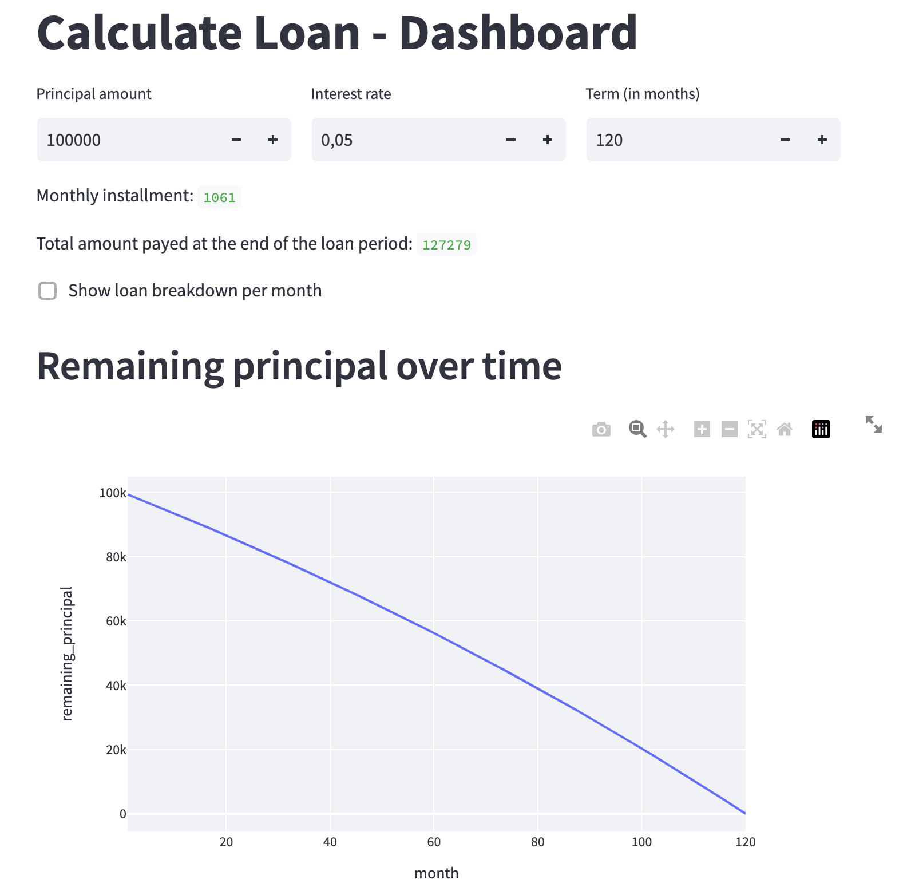

# Loan calculation in Python and displaying some metrics on a Dashbaord using Streamlit

The dashboard is avaliable on the following link: [https://krinya-loan-calculation-loan-dashboard-ox0kk4.streamlit.app/](https://krinya-loan-calculation-loan-dashboard-ox0kk4.streamlit.app/)

Or you can run it localy:
* install the following packages via pip: streamlit, pandas, plotly
* open and run in the terminal the following command: 'streamlit run loan_dashboard.py'
* it will pop up a browser window where you will be able to see someting like this:

